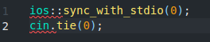
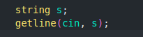

###Input and Output
Input and output is sometimees a bottleneck in the program. The following lines at the beginning of the code make input and output more efficient:

note that \n works more faster than endl, because endl always causes a flush operation.

###for string :
Sometimes the program should read a whole from the input, possibly containing spaces. This can be accomplished by using the getline function:

#If the amount of data is unknown, the following loop is useful:

This loop reads elements from the input one after another, until there is no more data available in the input.
